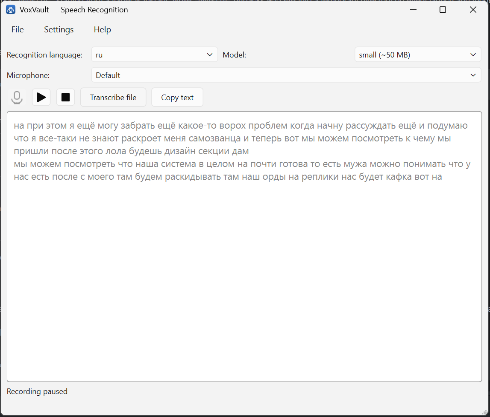

# VoxVault — Speech → Text (offline, free, private)

[Русский](docs/README.ru.md) | **English** | [简体中文](docs/README.zh.md)

**A free speech recognition application that runs offline and never sends your
data to the internet.**

Microphone recording and audio file transcription powered by
[VOSK](https://alphacephei.com/vosk/) (Kaldi ASR) — local, on CPU, no GPU, no
cloud. 30+ recognition languages, 9 interface languages.

<p align="center">
  <a href="LICENSE"></a>
  
  
  
  
  
  
  
  
</p>

<p align="center">
  
</p>

## Why VoxVault

- **Free** — no subscription, payment or ads.
- **Private** — recordings and texts stay on your computer.
- **Offline** — once models are downloaded, no internet is needed.
- **Live transcription** — text appears while you speak, with pause and stop.
- **History** — every recognition is stored in SQLite and is searchable.

## Installation

Download `VoxVault-<version>-win64.zip` from the **Releases** section of this
repository on GitHub, unpack it into any folder and run `VoxVault.exe`.
Python is not required.

On first launch the app asks for the interface language and offers to download a
recognition model for the language you picked. **Models are not bundled**
(50 MB–1.8 GB each) — they are downloaded separately and stored next to the app.

<details>
<summary>Run from source (development)</summary>

```powershell
py -m pip install -e ".[gui]"     # + CLI dependencies
winget install Gyan.FFmpeg        # optional, for mp3/m4a/ogg

py main.py gui-qt                 # graphical application
py -m pytest                      # tests
```

</details>

## Building the exe (developers)

Requires Python 3.12 (PyInstaller lags behind new Python releases).

```powershell
py -m pip install -e ".[gui,dev]"
python packaging\build.py --clean --zip
```

Result: `dist\VoxVault\` (a folder with the exe and DLLs) and
`dist\VoxVault-<version>-win64.zip` — the zip is the file to attach to a GitHub
Release.

The build is `onedir`, not `onefile`: starting from a folder is instant, while
`onefile` unpacks ~55 MB into a temporary directory on every launch and triggers
antivirus false positives.

### One file instead of a folder

If you need exactly one `.exe` with no `_internal` folder:

```powershell
python packaging\build.py --clean --onefile
```

You get `dist\VoxVault.exe` (55 MB) which unpacks itself into
`%TEMP%\_MEI…` on every launch. It works (verified), but:

| | folder (`onedir`) | single file (`onefile`) |
|---|---|---|
| startup | ~1.0 s | ~2.0 s |
| size on disk | 152 MB | 55 MB |
| extra work at launch | none | unpacks 147 MB to a temp directory |
| antivirus | rarely triggers | triggers noticeably more often |

For a fast daily start the folder is better. If you need exactly one file to
download — use `--onefile`, or an installer (see below).

### Installer instead of a zip

The portable zip needs unpacking and leaves `_internal` next to the exe. If you
want a familiar "one setup.exe" with a Start Menu shortcut, that is a separate
task (NSIS/Inno Setup/InstallShield) and it has not been done.

Diagnostics for the built application (attach the output if something misbehaves):

```powershell
dist\VoxVault\VoxVault.exe --selftest
```

Releases are published by tag: push `v0.3.0` → GitHub Actions builds the exe,
runs the tests and `--selftest`, and attaches the zip to the release
(`.github/workflows/release.yml`).

## Quick start (CLI)

```powershell
dictophone gui-qt                            # graphical application
dictophone list                              # available languages and models
dictophone devices                           # list microphones
dictophone config lang=uk size=small         # remember settings
dictophone file meeting.mp3                  # → out_text\meeting.txt
dictophone mic                               # realtime → out_text\mic_<ts>.txt
dictophone history                           # what was recognised before
```

Every command also works as `py main.py <command>` and in the built exe:
`VoxVault.exe file meeting.mp3`.

## Commands

| Command | What it does |
|---|---|
| `gui` | graphical application (tkinter fallback) |
| `gui-qt` | graphical application (PySide6, the main one) |
| `list` | list of languages and VOSK model names |
| `devices` | list of input audio devices (microphones) |
| `config [KEY=VALUE …]` | show/change settings; `--reset` — reset; `--path` — custom file |
| `download` | download a model: `--lang`, `--size small\|large` |
| `file AUDIO` | transcribe a file: `--lang`, `--size`, `-o`, `--output-dir`, `--words`, `--no-punct`, `--no-history` |
| `mic` | realtime from the microphone: `--lang`, `--size`, `--device`, `-o`, `--output-dir`, `--words`, `--no-punct`, `--no-history` |
| `history` | recognition history: `--limit`, `--search`, `--lang`, `--kind`; subcommands `show <id>`, `delete <id>`, `clear --yes` |

Options shared by `file`/`mic`/`download`: `--model-dir` — models directory
(default `<root>/models`).

## Graphical application

```powershell
dictophone gui-qt
```

The window has microphone, recognition language and model size selectors,
record/pause/stop buttons drawn as pictograms with tooltips, a live text area, a
settings dialog and a searchable history browser.

Recognition runs in a separate thread and events reach Qt through signals, so
the interface never freezes — even with a `large` model (which takes up to a
minute and a half to load). Settings are written to a shared config file, so the
CLI and the GUI use the same options.

On startup the app checks whether a model for the selected language is present
and offers to download it if not. The model is warmed up in the background, so
the record button responds immediately.

### Single instance only

Two copies cannot run at once: the second one sees the lock and shows a message.
This prevents duplicate windows, duplicate background model loads and SQLite
locking errors in the shared `history.db`. An escape hatch exists for
troubleshooting: the `VOXVAULT_NO_SINGLE_INSTANCE=1` environment variable (it is
set in the test suite).

## Recognition history (SQLite)

Every recognition is stored automatically
(`%APPDATA%\dictophone\history.db`): date, kind (`mic`/`file`), language, model
size, device, audio duration and the text itself.

```powershell
dictophone history --limit 10
dictophone history --search "meeting"
dictophone history show 3
dictophone history delete 3
dictophone history clear --yes
```

Disable it with `dictophone config history=false` or the `--no-history` flag.
The GUI shows the same database in the History window.

## Punctuation and capitalisation

VOSK outputs text without capital letters and punctuation. By default the
`postprocess=heuristic` heuristic is enabled: capitalisation at the start of
phrases, a period at segment boundaries and a period at the end.

```powershell
dictophone file a.wav                 # with punctuation
dictophone file a.wav --no-punct      # exactly as recognised by VOSK
dictophone config postprocess=off     # same, permanently
```

Honest limitations: **commas are not restored** — without syntactic parsing any
rule produces nonsense such as "How, are you". A neural model
(`vosk-recasepunc`, 1.6 GB, not published as a separate PyPI package) can be
plugged in via `postprocess.set_backend()` — the extension point is ready.

## Automatic language detection

```powershell
dictophone file speech.wav --lang auto
```

All installed models are tried and the one with the highest average word
confidence wins (confidence drops for words that are not in its language). It
works for files; for realtime microphone input it makes no sense. Accuracy is
heuristic and may fail on very similar languages.

## Settings

File: `%APPDATA%\dictophone\config.json` (overridable with the
`DICTOPHONE_CONFIG` environment variable).

```powershell
dictophone config                                   # show
dictophone config lang=en-us size=large             # set
dictophone config device=                           # reset the device
dictophone config --reset                           # everything to default
```

| Key | Meaning | Default |
|---|---|---|
| `lang` | recognition language (or `auto`) | `ru` |
| `size` | `small` / `large` | `small` |
| `device` | index or part of a microphone name | default device |
| `output_dir` | where transcripts are written | `<root>/out_text` |
| `model_dir` | where models live | `<root>/models` |
| `postprocess` | `heuristic` / `off` | `heuristic` |
| `history` | write recognitions to SQLite | `true` |
| `db_path` | history database path | `%APPDATA%/dictophone/history.db` |
| `ui_lang` | interface language | detected on first run |

**Precedence:** built-in defaults < settings file < CLI arguments. So after
`dictophone config lang=de`, `dictophone file a.wav` uses `de`, while
`dictophone file a.wav --lang fr` uses `fr`.

## How realtime works

1. `devices.resolve_device()` picks the input by setting/argument.
2. `iter_mic()` is an event generator: it reads 16 kHz mono int16 PCM in ~0.4 s
   blocks and yields `SpeechEvent(kind="partial"|"final", text=...)`.
3. `transcribe_mic()` prints partial results in place, final ones on their own
   line, and returns the full text.

The generator is the GUI extension point: run it in your own thread and get
partial results in a callback without rewriting anything. Stopping:
`threading.Event` (for the GUI) or Ctrl+C (for the CLI, where the last segment
still gets flushed).

## Models

```powershell
dictophone download --lang ru --size small    # ~50 MB
dictophone download --lang ru --size large    # ~1.8 GB, more accurate
```

- `small` — fast, ~300 MB RAM, good for realtime microphone use.
- `large` — more accurate, but **takes 60–90 s to load** and needs a lot of RAM.
  Best choice for `file`, overkill for `mic`.
- The size is chosen explicitly with `--size`.
- Languages are matched strictly against the registry, so `--lang ar` will not
  pick up Tunisian Arabic `vosk-model-small-ar-tn-…`. A custom model (not in
  the registry) is connected by pointing at its folder:
  `--model-dir <path-to-model-folder>`.

- You can also download a model manually from the official page — unpack it into
  `models/`.
- Downloads go to a temporary `.part` file with three attempts: a broken file
  never remains under the final name, the archive is verified, and after
  unpacking the required files are checked (`am/final.mdl`, `conf/mfcc.conf`,
  `conf/model.conf`, `graph/Gr.fst`, `graph/HCLr.fst`,
  `graph/phones/word_boundary.int`). An incomplete model is deleted.
  Note: `graph/words.txt` is **absent** from the official VOSK archives and must
  not be required — otherwise a perfectly good model gets deleted as incomplete.

### Recognition languages (33)

These codes are used in `--lang` and in the `config lang=…` setting. Models are
downloaded by the app; `—` means the VOSK registry has no such size for that
language.

| Code | small | large |
|---|---|---|
| `ar` | — | `vosk-model-ar-mgb2-0.4` |
| `br` | — | `vosk-model-br-0.8` |
| `ca` | `vosk-model-small-ca-0.4` | — |
| `cn` | `vosk-model-small-cn-0.22` | `vosk-model-cn-0.22` |
| `cs` | `vosk-model-small-cs-0.4-rhasspy` | — |
| `de` | `vosk-model-small-de-0.15` | `vosk-model-de-0.21` |
| `el-gr` | — | `vosk-model-el-gr-0.7` |
| `en-in` | `vosk-model-small-en-in-0.4` | `vosk-model-en-in-0.5` |
| `en-us` | `vosk-model-small-en-us-0.15` | `vosk-model-en-us-0.22` |
| `eo` | `vosk-model-small-eo-0.42` | — |
| `es` | `vosk-model-small-es-0.42` | `vosk-model-es-0.42` |
| `fa` | `vosk-model-small-fa-0.42` | `vosk-model-fa-0.42` |
| `fr` | `vosk-model-small-fr-0.22` | `vosk-model-fr-0.22` |
| `gu` | `vosk-model-small-gu-0.42` | `vosk-model-gu-0.42` |
| `hi` | `vosk-model-small-hi-0.22` | `vosk-model-hi-0.22` |
| `it` | `vosk-model-small-it-0.22` | `vosk-model-it-0.22` |
| `ja` | `vosk-model-small-ja-0.22` | `vosk-model-ja-0.22` |
| `ka` | `vosk-model-small-ka-0.42` | `vosk-model-ka-0.42` |
| `ko` | `vosk-model-small-ko-0.22` | — |
| `ky` | `vosk-model-small-ky-0.42` | `vosk-model-ky-0.42` |
| `kz` | `vosk-model-small-kz-0.42` | `vosk-model-kz-0.42` |
| `nl` | `vosk-model-small-nl-0.22` | `vosk-model-nl-spraakherkenning-0.6` |
| `pl` | `vosk-model-small-pl-0.22` | — |
| `pt` | `vosk-model-small-pt-0.3` | `vosk-model-pt-fb-v0.1.1-20220516_2113` |
| `ru` | `vosk-model-small-ru-0.22` | `vosk-model-ru-0.42` |
| `sv` | `vosk-model-small-sv-rhasspy-0.15` | — |
| `te` | `vosk-model-small-te-0.42` | — |
| `tg` | `vosk-model-small-tg-0.22` | `vosk-model-tg-0.22` |
| `tl-ph` | — | `vosk-model-tl-ph-generic-0.6` |
| `tr` | `vosk-model-small-tr-0.3` | — |
| `uk` | `vosk-model-small-uk-v3-nano` | `vosk-model-uk-v3` |
| `uz` | `vosk-model-small-uz-0.22` | — |
| `vn` | `vosk-model-small-vn-0.4` | `vosk-model-vn-0.4` |

- `large` only: `ar`, `br`, `el-gr`, `tl-ph`.
- `small` only: `ca`, `cs`, `eo`, `ko`, `pl`, `sv`, `te`, `tr`, `uz`.
- The same table is printed by `dictophone list`.

Interface languages are a separate thing: there are 9 of them —
`ru`, `uk`, `be`, `en`, `de`, `fr`, `es`, `it`, `zh` — chosen on first launch and
under `Settings → Interface`. They do not have to match the recognition
language.

## Performance (rough figures)

| | load | RAM | Russian quality |
|---|---|---|---|
| small-ru-0.22 | seconds | ~0.3 GB | good |
| ru-0.42 | 60–90 s | several GB | noticeably better |

Recognition runs faster than real time on both models.

## Project structure

```
├── main.py                  — entry point (no package install needed)
├── pyproject.toml           — metadata, dependencies, extras, pytest config
├── README.md                — English (default)
├── LICENSE                  — Apache-2.0
├── docs/
│   ├── README.ru.md         — Russian
│   ├── README.zh.md         — Chinese (Simplified)
│   └── screen.png           — application screenshot
├── src/
│   ├── requirements.txt     — dependencies (canonical list in pyproject.toml)
│   └── dictophone/
│       ├── __init__.py      — version
│       ├── cli.py           — ArgumentParser, settings, routing
│       ├── gui_qt.py        — main window (PySide6)
│       ├── qt_settings.py   — settings dialog
│       ├── qt_history.py    — history window
│       ├── qt_model_dialog.py — model picker/downloader on startup
│       ├── qt_language.py   — first-run language choice
│       ├── qt_workers.py    — background tasks (model, microphone, network)
│       ├── single_instance.py — single-instance guard
│       ├── app_icon.py      — window icon and .ico for the exe
│       ├── i18n.py          — translations, locales/*.json
│       ├── models.py        — registry, download, load, integrity checks
│       ├── transcribe.py    — audio + recognition (file / microphone)
│       ├── config.py        — user settings
│       ├── devices.py       — input audio devices
│       ├── storage.py       — recognition history (SQLite)
│       ├── postprocess.py   — capitalisation and punctuation
│       ├── gui.py           — tkinter fallback application
│       └── console.py       — UTF-8 in the console
├── packaging/
│   ├── VoxVault.spec        — PyInstaller build (onedir)
│   ├── launcher.py          — exe entry point + --selftest
│   ├── build.py             — build, checks, release zip
│   └── make_icon.py         — generates assets/VoxVault.ico
├── .github/workflows/       — ci.yml (tests+build), release.yml (tagged release)
├── tests/                   — pytest
├── models/                  — VOSK models (input, NOT committed to git)
├── out_text/                — transcripts (output)
└── test/                    — test audio files
```

Dependencies: `cli → (models, transcribe, config, devices, storage, gui*)`,
`transcribe → (models, postprocess)`, `config ↔ postprocess` (value checks
only). Modules do not know about each other cyclically.

As a library:

```python
from pathlib import Path
from dictophone.transcribe import transcribe, iter_mic, transcribe_file
from dictophone.models import load_model
from dictophone.storage import Storage, Entry

result = transcribe(Path("audio.wav"), lang="ru", size="small")
print(result.text, result.audio_s, result.avg_conf)

model = load_model(lang="ru", size="small")
for event in iter_mic(model, device=None):      # event stream
    print(event.kind, event.text)

with Storage() as db:
    db.add(Entry(kind="file", text=result.text, lang=result.lang))
```

## Windows specifics

- VOSK (C++/Kaldi) cannot open files on non-ASCII paths. If the project lives in
  a folder with Cyrillic characters (e.g. `C:\work\диктофон`), loading a model
  automatically creates a junction in
  `%LOCALAPPDATA%\dictophone\vosk_ascii\<folder>_<hash>` and loads the model
  from there. Override with `VOSK_ASCII_ROOT`.
- The console is switched to UTF-8 automatically, otherwise Russian text turns
  into mojibake.
- mp3/m4a/ogg require `ffmpeg`.
- In the built version, models and texts are placed **next to the exe**, and if
  the folder is not writable (e.g. installed into `Program Files`) — in
  `%LOCALAPPDATA%\VoxVault`.

## Roadmap

- Neural punctuation/capitalisation (`vosk-recasepunc`) — the
  `postprocess.set_backend()` extension point is ready, only the backend is
  missing.
- Remove the tkinter fallback UI (`gui.py`) after successful releases.
- Better automatic language detection (currently a confidence heuristic).
- Resuming interrupted model downloads (HTTP Range).
